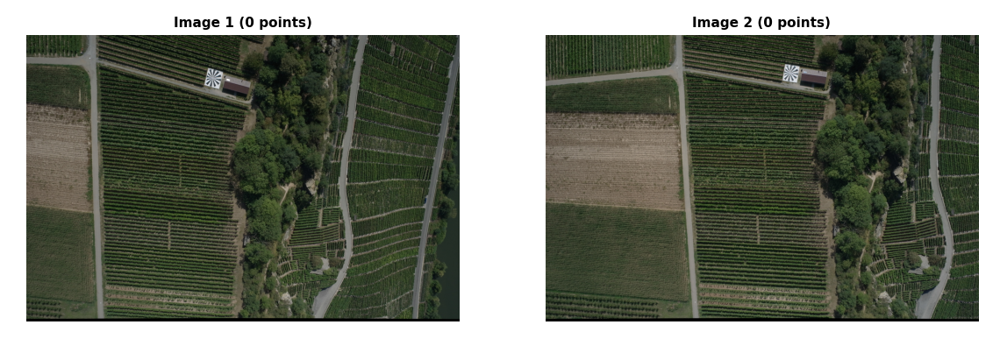
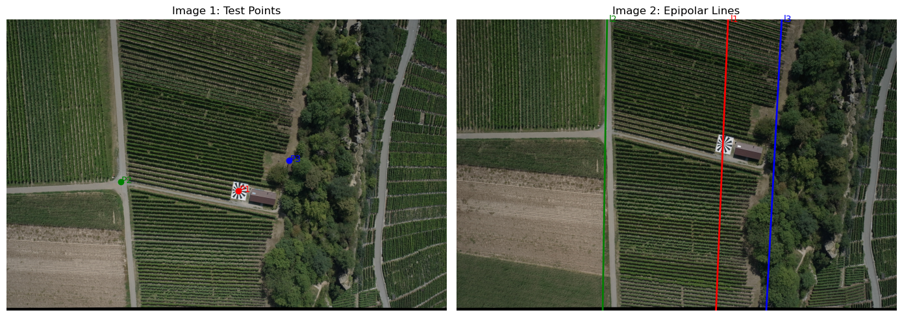

# Photogrammetry & Computer Vision

A photogrammetric computer vision project exploring camera geometry, 3D reconstruction, camera pose estimation, Direct Linear Transformation (DLT), and epipolar geometry using Python.

The project is organized into two practical notebooks covering fundamental methods for reconstructing 3D information from images and analyzing the geometric relationship between multiple views.

## Project Overview

The main goal of this project was to implement and explore core photogrammetric and computer vision techniques using image observations and camera geometry.

The workflow includes:

- Forward intersection for 3D point reconstruction
- Camera pose and orientation estimation
- Spatial resection
- Direct Linear Transformation (DLT)
- Stereo image analysis
- Fundamental matrix estimation
- Epipolar geometry and epipolar lines

## Camera Geometry & 3D Reconstruction

The first part focuses on the relationship between 3D object points and their corresponding image coordinates.

### Forward Intersection

Forward intersection is used to reconstruct the 3D position of an object point from observations in multiple images.

### Spatial Resection

Spatial resection estimates the position and orientation of a camera from known 3D object points and their corresponding image observations.

### Direct Linear Transformation

DLT provides a linear formulation for estimating the projection relationship between 3D object coordinates and 2D image coordinates.

These methods demonstrate the basic geometric principles behind photogrammetric reconstruction and camera calibration.

## Epipolar Geometry

The second part explores the geometric relationship between a stereo image pair.



The fundamental matrix describes the relationship between corresponding points in two images. Using this relationship, a point selected in one image defines an epipolar line in the other image.

### Epipolar Lines

The visualization below shows corresponding epipolar constraints across the stereo images.



Epipolar geometry is an important foundation for stereo matching, image correspondence, and 3D reconstruction from multiple views.

## Tools & Technologies

- Python
- Jupyter Notebook
- NumPy
- OpenCV
- Matplotlib
- Linear algebra
- Singular Value Decomposition (SVD)

## Key Skills Demonstrated

- Photogrammetric computer vision
- Camera geometry
- 3D reconstruction
- Forward intersection
- Spatial resection
- Direct Linear Transformation
- Fundamental matrix estimation
- Epipolar geometry
- Stereo image analysis
- Image-based geometric computation

## Repository Structure

```text
Photogrammetry-Computer-Vision/
├── README.md
├── notebooks/
│   ├── 01-camera-geometry-and-dlt.ipynb
│   └── 02-epipolar-geometry.ipynb
└── images/
    ├── 01-stereo-image-pair.png
    └── 02-epipolar-lines.png
